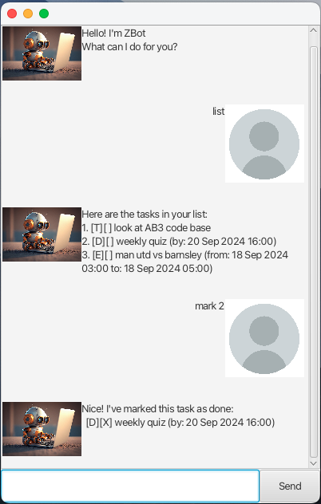
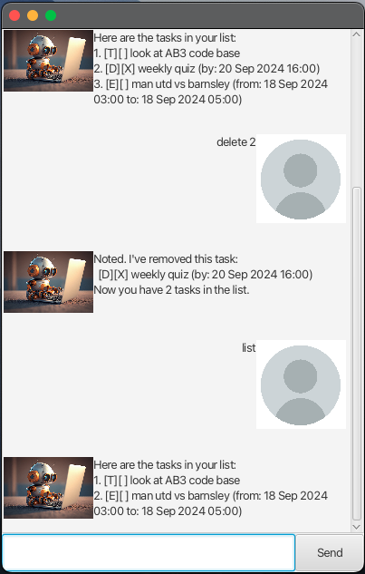

# ZBot User Guide

ZBot is a task management application that helps you keep track of your tasks efficiently. With a user-friendly GUI, ZBot allows you to add, delete, and manage tasks with ease. Whether you need to set deadlines, create events, or simply jot down tasks, ZBot is designed to streamline your workflow and boost productivity.

- [ZBot User Guide](#zbot-user-guide)
  - [Quickstart](#quickstart)
  - [Features](#features)
    - [List tasks : `list`](#list-tasks--list)
    - [Add task : `todo`](#add-task--todo)
    - [Add task with deadline : `deadline`](#add-task-with-deadline--deadline)
    - [Add task with start and end datetime : `event`](#add-task-with-start-and-end-datetime--event)
    - [Mark task : `mark`](#mark-task--mark)
    - [Unmark task : `unmark`](#unmark-task--unmark)
    - [Delete task : `delete`](#delete-task--delete)
    - [Find task : `find`](#find-task--find)
    - [Add note : `note`](#add-note--note)
    - [Exiting the program : `bye`](#exiting-the-program--bye)
  - [Saving the data](#saving-the-data)
  - [Command summary](#command-summary)

## Quickstart
1. Ensure you have Java `17` or above installed in your Computer.

1. Download the latest `.jar` file from [here](https://github.com/liauzhanyi/ip/releases/tag/A-Release).

1. Copy the file to the folder you want to use as the home folder for your tasks.

1. Open a command terminal, `cd` into the folder you put the jar file in, and use the `java -jar zbot.jar` command to run the application.

1. Type the command in the text box at the bottom and press Enter to execute it.
   
    Some example commands you can try:

    `todo make bed` : Adds a "make bed" task.

    `todo sweep floor` : Adds a "sweep floor" task.

    `list` : Lists all tasks.

    `delete 2` : Deletes the 2nd task shown in the current list.

    `bye` : Exits the app.

1. Refer to the [Features](#features) below for details of each command.

## Features

> **Notes about the command format:**
> 
> Words in `UPPER_CASE` are the parameters to be supplied by the user.
> e.g. in `todo TASK`, `TASK` is a parameter which can be used as `todo try zbot`.
> 
> Items in square brackets are optional.
> e.g `DATE [TIME]` can be used as `01/01/2024 2359` or as `01/01/2024`.
>
> DATE parameters should be given in the format `dd/MM/yyyy` (eg. 01/01/2024)
> and TIME parameters should be given in 24-hour format `HHmm` (eg. 0130)
> 
> Parameters should be keyed in order.
> e.g. if the command specifies `TASK DATE`, command should be entered as `countdown 01/01/> 2024` and **not** `01/01/2024 countdown`
> 
> If you are using a PDF version of this document, be careful when copying and pasting > commands that span multiple lines as space characters surrounding line-breaks may be > omitted when copied over to the application.

### List tasks : `list`

Show all tasks stored.

Format: `list`

### Add task : `todo`

Adds a task to the list.

Format: `todo TASK`

Examples:

- `todo try zbot`
- `todo buy groceries at the supermarket`

### Add task with deadline : `deadline`

Adds a task with deadline to the list.

Format: `deadline TASK /by DATE [TIME]`

Examples:

- `deadline try zbot /by 20/09/2024`
- `deadline buy groceries at the supermarket /by 20/09/2024 1600`

### Add task with start and end datetime : `event`

Adds a task with start date, time and end date, time to the list.

Format: `event TASK /from DATE TIME /to DATE TIME`

Examples:

- `event try zbot /from 19/09/2024 2330 /to 20/09/2024 0030`
- `event buy groceries at the supermarket /from 20/09/2024 1600 /to 20/09/2024 1800`

### Mark task : `mark`

Mark the specified task as completed.

Format: `mark INDEX`

- Marks the task at the specified `INDEX` as completed. The index refers to the index number shown in the displayed person list. The index **must be a positive integer** 1, 2, 3, …​

Example:

- `mark 2`

### Unmark task : `unmark`

Mark the specified task as not completed.

Format: `unmark INDEX`

- Marks the task at the specified `INDEX` as not completed. The index refers to the index number shown in the displayed person list. The index **must be a positive integer** 1, 2, 3, …​

Example:

- `unmark 2`

 
### Delete task : `delete`

Delete the specified task from list. 

Format: `delete INDEX`

- Delete the task at the specified `INDEX` as completed. The index refers to the index number shown in the displayed person list. The index **must be a positive integer** 1, 2, 3, …​

- Note that deleting a task changes the index of subsequent remaining tasks. It is recommended to use the `list` command to confirm the index before `delete` as the operation cannot be reversed.

Example:

- `delete 2` will delete the 2nd task in the list.

### Find task : `find`

Finds task(s) with description that matches the keyword.

Format: `find KEYWORD`

- The search is **case-sensitive**. 

- If `KEYWORD` consists of multiple words, it will be treated as a phrase.

- Only tasks with description that contains the full `KEYWORD` will be returned.

Examples:

- `find look` will return both task 1 and 3 
- `find look at code` will only return task 3 

### Add note : `note`

Adds a note to specified task.

Format: `note INDEX NOTE`

Examples:

- `note 1 link to code base: https://github.com/se-edu/addressbook-level3` will add the note "link to code base: https://github.com/se-edu/addressbook-level3" to the first task. 

### Exiting the program : `bye`

Exits the program.

Format: `bye`

## Saving the data

ZBot data are saved in the hard disk automatically after any command that changes the data. There is no need to save manually.

## Command summary

| Action | Format | Examples |
| --- | --- | --- |
| Add | `todo TASK` | `todo try zbot` |
| Add | `deadline TASK /by DATE [TIME]` | `deadline try zbot /by 20/09/2024` |
| Add | `event TASK /from DATE TIME /to DATE TIME` | `event try zbot /from 19/09/2024 2330 /to 20/09/2024 0030` |
| List | `list` | |
| Mark | `mark INDEX` | `mark 1` |
| Unmark | `unmark INDEX` | `unmark 1` |
| Delete | `delete INDEX` | `delete 1` |
| Find | `find KEYWORD` | `find look at` |
